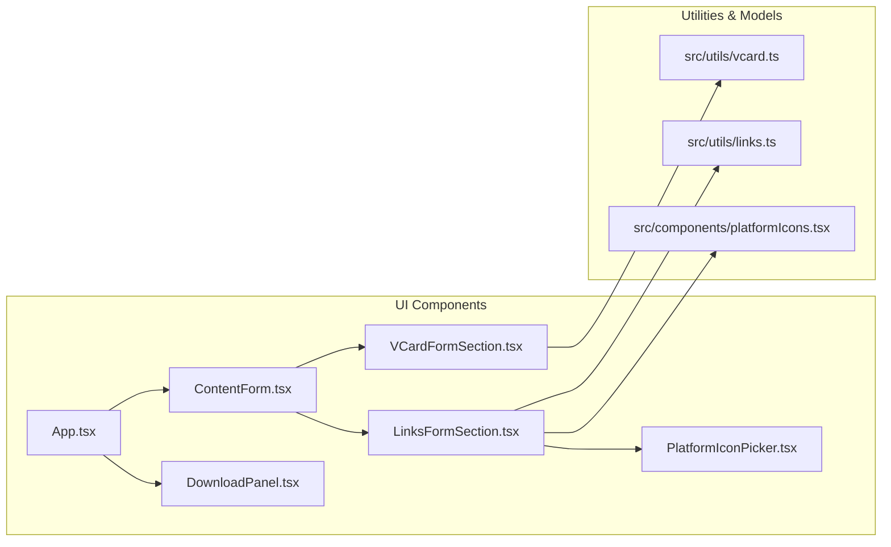

# Product Requirement Document (PRD): vCard Extended Fields & Multi-Link Manager Expansion

**Project**: QR.ca (Canadian-native QR Code Generator)  
**Document Version**: 2.0.0  
**Status**: Ready for Implementation  
**Target Milestone**: Phase 2 — Advanced Content Types  

---

## 1. Executive Summary

QR.ca currently provides interactive prototype forms for generating QR codes across 6 content types (Website, vCard, Links Page, Text, Contact, Restaurant menu). However:
1. **vCard Form** is limited to 3 fields (Full Name, Phone, Work Email) without organization details, secondary phones, fax, physical address, or website, and does not serialize into the standardized `BEGIN:VCARD` format for direct contact saving on iOS and Android devices.
2. **Links Page** offers only a static single URL input rather than an interactive bio-link aggregator with dynamic multi-link creation, branded platform icon selection, reordering, and link removal.
3. **Payload Synchronization**: Content inputs are not yet piped into the live `QrCodeView` and `DownloadPanel`, leaving the QR preview detached from user form edits.

This PRD defines the specifications, data contracts, UX designs, and sequential implementation tasks to deliver an enterprise-grade vCard generator with comprehensive optional fields and a drag/reorder multi-link bio page builder.

---

## 2. User Stories & Goals

### 2.1 vCard Generator
- **US-1.1**: As a business professional, I want to add my Company Name, Work Title, Work Phone, Fax, Physical Address (Street, City, State/Province, ZIP/Postal Code, Country), Website, and Notes to my QR business card so that scanning it imports a complete contact profile into any smartphone.
- **US-1.2**: As a user with minimal needs, I want all non-essential fields to be explicitly marked as optional and organized with progressive disclosure so the form is fast and not overwhelming.
- **US-1.3**: As a Canadian business user, address fields must support Canadian provinces and postal code conventions (e.g., `ON`, `M5V 2T6`) while gracefully supporting international formats.

### 2.2 Links Page Manager
- **US-2.1**: As a creator or brand owner, I want to add multiple external links to my QR landing page with custom titles and destination URLs.
- **US-2.2**: As a creator, I want to assign recognizable brand logos/icons (Instagram, TikTok, LinkedIn, YouTube, X, GitHub, Facebook, Spotify, Discord, Website, Mail, Phone) to each link.
- **US-2.3**: As a creator, I want to reorder my links (move up/down) to highlight high-priority promotions, and remove links I no longer need.
- **US-2.4**: As a creator, I want changes in my links to immediately update the generated QR code.

---

## 3. Detailed Feature Specifications

### 3.1 Feature A: vCard Extended Fields & Native vCard 3.0 Serialization

#### A.1 Data Model
```typescript
export interface VCardData {
  // Primary (Core)
  firstName: string;
  lastName: string;
  email: string;
  cellPhone: string;

  // Work & Organization (Optional)
  company: string;
  jobTitle: string;
  workPhone: string;
  fax: string;

  // Address (Optional)
  street: string;
  city: string;
  state: string; // Province / State
  zipCode: string; // Postal Code / ZIP
  country: string;

  // Online & Notes (Optional)
  website: string;
  notes: string;
}
```

#### A.2 Field Specifications & vCard 3.0 Mapping

| UI Field Label | Key | vCard 3.0 Standard Token | Required? | Placeholder Example |
|---|---|---|---|---|
| **First Name** | `firstName` | `N:Last;First;;;` / `FN:` | Required (or First+Last) | `Alex` |
| **Last Name** | `lastName` | `N:Last;First;;;` / `FN:` | Optional | `Morgan` |
| **Mobile Phone** | `cellPhone` | `TEL;TYPE=CELL,VOICE:` | Recommended | `+1 (416) 555-0192` |
| **Work Email** | `email` | `EMAIL;TYPE=WORK,INTERNET:` | Recommended | `alex@startup.ca` |
| **Company Name** | `company` | `ORG:` | Optional | `Northern Lights Labs Inc.` |
| **Job Title** | `jobTitle` | `TITLE:` | Optional | `VP of Engineering` |
| **Work Phone** | `workPhone` | `TEL;TYPE=WORK,VOICE:` | Optional | `+1 (416) 555-0199` |
| **Fax** | `fax` | `TEL;TYPE=FAX:` | Optional | `+1 (416) 555-0101` |
| **Street Address** | `street` | `ADR;TYPE=WORK:;;Street;City;State;Zip;Country` | Optional | `100 King St W, Suite 400` |
| **City** | `city` | In `ADR` token | Optional | `Toronto` |
| **Province / State** | `state` | In `ADR` token | Optional | `ON` |
| **Postal / ZIP Code** | `zipCode` | In `ADR` token | Optional | `M5X 1A9` |
| **Country** | `country` | In `ADR` token | Optional | `Canada` |
| **Website** | `website` | `URL:` | Optional | `https://startup.ca` |
| **Notes / Bio** | `notes` | `NOTE:` | Optional | `Connect with me for partnerships & speaking.` |

#### A.3 Serialization Rules (`src/utils/vcard.ts`)
- Escapes reserved characters (`\`, `;`, `,`, newlines) according to RFC 2426.
- Constructs formatted `FN` (Full Name) and `N` (Structured Name).
- Formats compound address into standard 7-part semicolon-delimited `ADR;TYPE=WORK:;;street;city;state;zip;country`.
- Omits empty fields to keep QR payload compact and ensure maximal scanning reliability.
- Wraps output in `BEGIN:VCARD\nVERSION:3.0\n...\nEND:VCARD`.

---

### 3.2 Feature B: Links Page Multi-Link Manager

#### B.1 Data Model
```typescript
export type PlatformLogoKey =
  | 'website'
  | 'instagram'
  | 'tiktok'
  | 'linkedin'
  | 'youtube'
  | 'x'
  | 'github'
  | 'facebook'
  | 'spotify'
  | 'discord'
  | 'email'
  | 'phone';

export interface LinkItem {
  id: string;
  title: string;
  url: string;
  platform: PlatformLogoKey;
  enabled: boolean;
}

export interface LinksPageData {
  profileTitle: string;
  bioUrlSlug: string;
  description: string;
  links: LinkItem[];
}
```

#### B.2 Platform Icon Registry
Each platform definition includes:
- Distinct vector SVG icon
- Brand badge background and foreground colors
- Default placeholder URL pattern (e.g. `https://instagram.com/username`)
- Default label hint

| Platform Key | Display Name | Brand Accent Hex | Default Domain Placeholder |
|---|---|---|---|
| `website` | **Website / Custom** | `#00A7F5` | `https://yourdomain.com` |
| `instagram` | **Instagram** | `#E1306C` | `https://instagram.com/username` |
| `tiktok` | **TikTok** | `#000000` | `https://tiktok.com/@username` |
| `linkedin` | **LinkedIn** | `#0A66C2` | `https://linkedin.com/in/username` |
| `youtube` | **YouTube** | `#FF0000` | `https://youtube.com/@channel` |
| `x` | **X (Twitter)** | `#111111` | `https://x.com/username` |
| `github` | **GitHub** | `#24292F` | `https://github.com/username` |
| `facebook` | **Facebook** | `#1877F2` | `https://facebook.com/page` |
| `spotify` | **Spotify** | `#1DB954` | `https://open.spotify.com/artist/...` |
| `discord` | **Discord** | `#5865F2` | `https://discord.gg/invite` |
| `email` | **Email** | `#EA4335` | `mailto:hello@example.com` |
| `phone` | **Call / SMS** | `#00BA7F` | `tel:+14165550192` |

#### B.3 Interaction Flow
1. **Add Link**: Appends a new item initialized with UUID, default platform (`website` or auto-detected by URL prefix), empty title, and URL.
2. **Select Logo**: Clicking the icon opens a popover or compact grid selector to switch between the 12 platform logos.
3. **Reorder Links**:
   - `Move Up` button (`ArrowUp`) disabled on the top item.
   - `Move Down` button (`ArrowDown`) disabled on the bottom item.
   - Smooth reordering with instant state update.
4. **Remove Link**: Trash icon removes the item (keeps at least 1 default link or provides a "+ Add your first link" empty state).
5. **QR Payload**: Generates a shareable URL (e.g. `https://qr.ca/p/{slug}#data...` or the base bio link URL).

---

## 4. UI/UX Specifications

### 4.1 Design Consistency
- Fonts: `Inter Tight`
- Border radii: `rounded-[12px]` for inputs, `rounded-[16px]` for cards/containers, `rounded-[28px]` for outer form panels.
- Colors:
  - vCard active accent: `#C778D9` (Orchid / Lilac)
  - Links Page active accent: `#9F87F7` (Soft Periwinkle Violet)
  - Neutral text: `#2c2e30`
  - Input border: `border-[rgba(44,46,48,0.16)]` with focus ring in the tab accent color.

### 4.2 vCard Progressive Disclosure
To prevent cognitive overload, the vCard form is structured into:
1. **Primary Information** (Full Name, Cell Phone, Work Email)
2. **Collapsible Section: "Professional & Work Details"** (Company Name, Job Title, Work Phone, Fax)
3. **Collapsible Section: "Address Details"** (Street, City, Province/State, Postal/ZIP, Country)
4. **Collapsible Section: "Web & Notes"** (Website, Additional Note/Bio)
Each section displays a count badge when non-empty fields are present.

### 4.3 Multi-Link Card Architecture
Each link item is rendered inside a card:
```text
┌────────────────────────────────────────────────────────────────────────┐
│ [≡ Grip] [ (Logo) Platform v ] [ Title Input       ] [ URL Input     ] [↑] [↓] [Trash] │
└────────────────────────────────────────────────────────────────────────┘
```
- Responsive layout stacks gracefully into 2 rows on mobile viewports (`< 640px`).

---

## 5. Technical Architecture & File Changes



---

## 6. Execution Tasks (Phase 2)

| Task ID | Document | Summary | Dependencies |
|---|---|---|---|
| **TASK-10** | [`TASK-10-vcard-extended-fields-and-encoder.md`](./TASK-10-vcard-extended-fields-and-encoder.md) | vCard TypeScript models, standard serialization logic (`vcard.ts`), and unit test fixtures. | None |
| **TASK-11** | [`TASK-11-vcard-form-ui.md`](./TASK-11-vcard-form-ui.md) | Responsive vCard form with progressive disclosure, input validation, and `#C778D9` accents. | TASK-10 |
| **TASK-12** | [`TASK-12-links-page-data-model-and-ordering.md`](./TASK-12-links-page-data-model-and-ordering.md) | Multi-link data structures, reorder engine, URL parsing, and platform registry. | None |
| **TASK-13** | [`TASK-13-links-page-interactive-ui.md`](./TASK-13-links-page-interactive-ui.md) | Interactive multi-link manager UI (Add, Move Up/Down, Remove, Logo Picker popover). | TASK-12 |
| **TASK-14** | [`TASK-14-qr-content-payload-integration.md`](./TASK-14-qr-content-payload-integration.md) | Centralized payload generation in `App.tsx`, live synchronization with `DownloadPanel` and `QrCodeView`. | TASK-10, 11, 12, 13 |
| **TASK-15** | [`TASK-15-verification-and-testing.md`](./TASK-15-verification-and-testing.md) | Oxlint, TypeScript verification, build validation, iOS/Android scan test specs. | TASK-14 |
