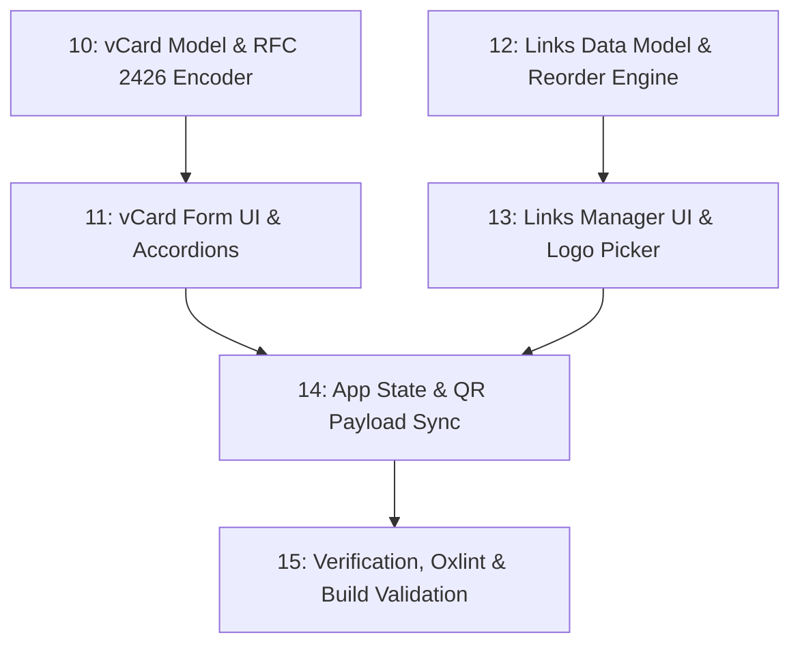

# QR.ca PRD — Sequential Execution Roadmap

This directory contains the Product Requirement Documents (PRDs) and technical execution tasks for updating the **QR.ca** web application to precisely match the Figma specification ([node `6062:2295`](https://www.figma.com/design/5NuyPHjiXxrvLJGuJZItCf/QR.ca-%25E2%2580%2593-Mockups?node-id=6062-2295)) and incorporate advanced content type expansions.

---

## Phase 1: Prototype Foundation & Design Alignments

| # | PRD Document | Focus Area | Status |
|---|---|---|---|
| **01** | [`TASK-01-logo-and-favicon.md`](./TASK-01-logo-and-favicon.md) | Official Figma Brand Logo & Favicon SVG Replacement | `Completed` |
| **02** | [`TASK-02-header-nav-alignment.md`](./TASK-02-header-nav-alignment.md) | Header Navigation Center-Alignment Fix | `Completed` |
| **03** | [`TASK-03-hero-headline-and-leaf.md`](./TASK-03-hero-headline-and-leaf.md) | Vectorized Canadian Maple Leaf & Subheading Single-Line | `Completed` |
| **04** | [`TASK-04-tab-filled-icons.md`](./TASK-04-tab-filled-icons.md) | High-Contrast Filled Icons for QR Type Navigation | `Completed` |
| **05** | [`TASK-05-tab-selection-colors.md`](./TASK-05-tab-selection-colors.md) | Per-Tab Selection Hex Color Architecture | `Completed` |
| **06** | [`TASK-06-figma-shape-svgs.md`](./TASK-06-figma-shape-svgs.md) | Exact Figma Vector SVGs for Step 2 Shape Options | `Completed` |
| **07** | [`TASK-07-static-design-tabs.md`](./TASK-07-static-design-tabs.md) | Static, Non-Clickable Design Tabs (Logo, Frame, Colors) | `Completed` |
| **08** | [`TASK-08-credit-card-badge-position.md`](./TASK-08-credit-card-badge-position.md) | Reposition "No Credit Card" Badge Directly Over QR Frame | `Completed` |
| **09** | [`TASK-09-verification-and-testing.md`](./TASK-09-verification-and-testing.md) | Typecheck, Oxlint, and Cross-Device Verification | `Completed` |

---

## Phase 2: vCard Extended Fields & Multi-Link Manager Expansion

Master Specification: [`PRD-vcard-and-links-expansion.md`](./PRD-vcard-and-links-expansion.md)

| # | PRD Document | Focus Area | Status |
|---|---|---|---|
| **10** | [`TASK-10-vcard-extended-fields-and-encoder.md`](./TASK-10-vcard-extended-fields-and-encoder.md) | vCard TypeScript models, standard serialization logic (`vcard.ts`), and unit test fixtures | `Completed` |
| **11** | [`TASK-11-vcard-form-ui.md`](./TASK-11-vcard-form-ui.md) | Responsive vCard form with progressive disclosure, input validation, and `#C778D9` accents | `Completed` |
| **12** | [`TASK-12-links-page-data-model-and-ordering.md`](./TASK-12-links-page-data-model-and-ordering.md) | Multi-link data structures, reorder engine, URL parsing, and platform registry | `Completed` |
| **13** | [`TASK-13-links-page-interactive-ui.md`](./TASK-13-links-page-interactive-ui.md) | Interactive multi-link manager UI (Add, Move Up/Down, Remove, Logo Picker popover) | `Completed` |
| **14** | [`TASK-14-qr-content-payload-integration.md`](./TASK-14-qr-content-payload-integration.md) | Centralized payload generation in `App.tsx`, live synchronization with `DownloadPanel` and `QrCodeView` | `Completed` |
| **15** | [`TASK-15-verification-and-testing.md`](./TASK-15-verification-and-testing.md) | Oxlint, TypeScript verification, build validation, iOS/Android scan test specs | `Completed` |

---

## Dependency Graph (Phase 2)

---

## Tech Stack & Conventions
- **Framework**: React 19 + TypeScript
- **Styling**: Tailwind CSS v4 (`@tailwindcss/vite`)
- **Icons**: Custom inline SVGs & Lucide React
- **Linter**: Oxlint (`npm run lint`)
- **Build**: Vite + TypeScript (`npm run build`)
